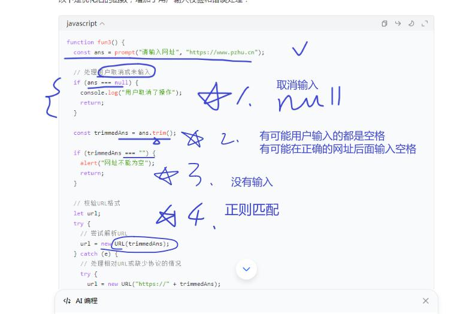
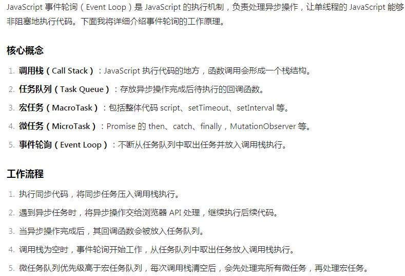

# 0. 工程素养
1. 注意不要在网页中嵌入恶意跳转代码
2. 不要恶意弹窗（无限循环×）
3. 防御性编程：用户什么都不输入；用户直接关闭输入框；用户输入的不是网址
# 1. BOM的属性
1. document(可以控制网页文档，对元素进行增删改查)
	1. document.body表示网页正文
	2. document.cookie 进行信息存储（name=value;）【重要，扩展】
		1. 前端写入cookie（JS）：例：临时保存用户的输入或操作
		2. 后端写入cookie（Java）：例：登录成功之后保存密码
2. location（定位，网页的URL：获取、设置【网页跳转】）【重要】
	1. location.href 获取URL
	2. location.href="网址" 跳转到新网址

# 2. BOM方法
## 1. 窗口的打开和关闭
1. open
2. close

## 2. 交互框
1. 警告框
2. 确认框
3. 询问框（需要对用户的输入进行完整性、合法性校验）


## 3. 定时器/计时器
1. 能够使用一次性定时器
2. 能够使用周期性定时器
3. 能够清除上述定时器
扩展：1. 防抖和节流 2.JS事件轮询


# 3. 事件处理
1. 【了解】事件的构成：元素（事件源 eg.按钮）、事件（eg.单击、动作）、程序（函数，eg.fun()）
## 1. 如何进行事件响应【重点】
1. 直接在元素中添加事件：简单、明了；不够灵活，不方便维护  ```<button onclick="fun1(); fun2();">点击我</button>```
2. 获取元素，为元素的事件属性赋值一个函数：灵活；一个事件只能赋值一个函数。 ```ele.onclick = fun1; ele.onclick = fun2;```错误
3. 获取元素，为元素添加事件监听（指定事件、指定处理程序）：灵活、可以移除