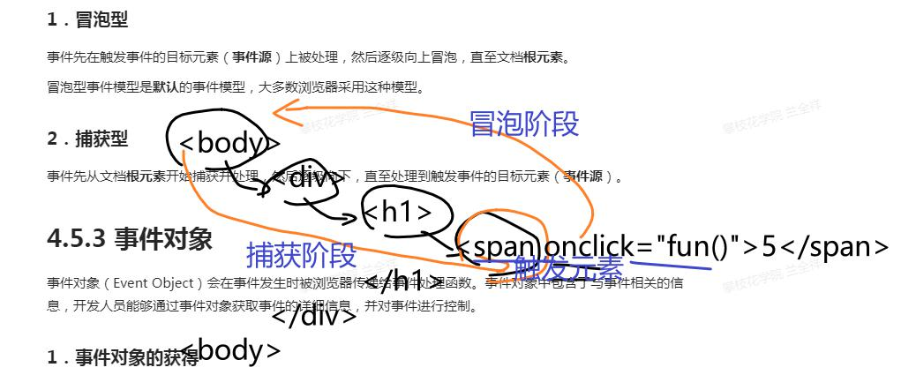

# 0. 工程素养
1. 删除节点：循环，删除document.body的所有子元素（×）
2. 利用document.cookie来窃取信息（信息安全）
3. 打开窗口：死循环，无限打开窗口、打开非法网站（×）

# 1. 节点的删除
``` deleteNode.parentNode.removeChild(deleteNode) ```
扩展：节点的克隆（深度、一般）、节点的替换

# 2. BOM浏览器对象模型（控制浏览器）
## 1. BOM属性
1. document
2. document.body
3. document.cookie【扩展、重要】存储信息
4. 【掌握】location（读取、设置）
## 2. 打开和关闭窗口
1. open
2. close
## 3. 交互框（用户互动）
1. 警告框：信息-->看（确认）
2. 确认框：信息-->确认/取消（true/false）
3. 询问框：问题-->回答（string）
## 4. 定时器
1. 执行一次的定时器
2. 周期性执行的定时器
3. 如何清除定时器
扩展：防抖和节流

# 3. 事件处理
## 1. 事件对象
1. JS事件的构成（网页元素、事件、函数）
2. 如何通过事件来触发函数
	1. 在标签【元素】中增加事件【事件】响应函数【函数】
	2. 获得网页元素【元素】，并为这个元素的事件属性【事件】赋值一个函数【函数】
	3. 获得网页元素【元素】，为这个元素的特定事件【事件】添加监听，监听到事件后执行函数【函数】
要求：能够使用上述三种方法来实现JS事件处理；扩展：了解他们的区别和优缺点

## 2. 事件模型
1. 了解事件模型
2. 知道捕获型和冒泡型

## 3. 事件属性

