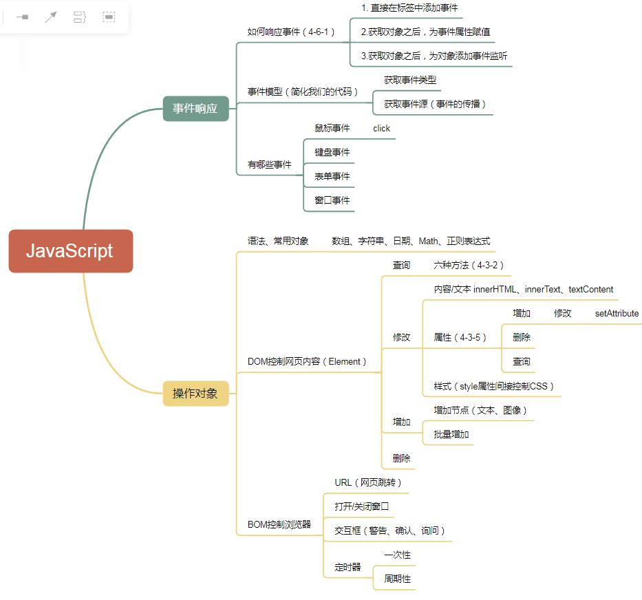

# 1. 事件模型
## 1. 事件传播（理解）
1. 事件传播的顺序（根节点--子节点--根节点）
2. 什么是捕获型
3. 什么是冒泡型
## 2. 事件对象event（重点）
1. 能够获取事件的类型 event.type
2. 能够获取事件的事件源 event.target
3. 能够阻止事件传播（消除事件传播带来的影响：会在传播路径上触发多个函数）

# 2. 常见事件
## 1. 鼠标事件
1. 单击/双击
2. 移入/移出（悬停/离开）
## 2. 键盘事件
1. 键盘键入事件
2. 如何判断用户输入的键的范围
## 3. 表单事件（重要）
1. change
2. 赋值粘贴
3. 获得/失去焦点
4. 表单提交/重置（数据验证【反面】）
	1. 判空  v ==""
	2. 判长度 v.length
	3. 判数字 isNaN(v)
	4. 复杂判断  正则表达式reg.text(v)
## 4. 窗口事件
1. load 资源加载完毕之后触发 4-3-2

